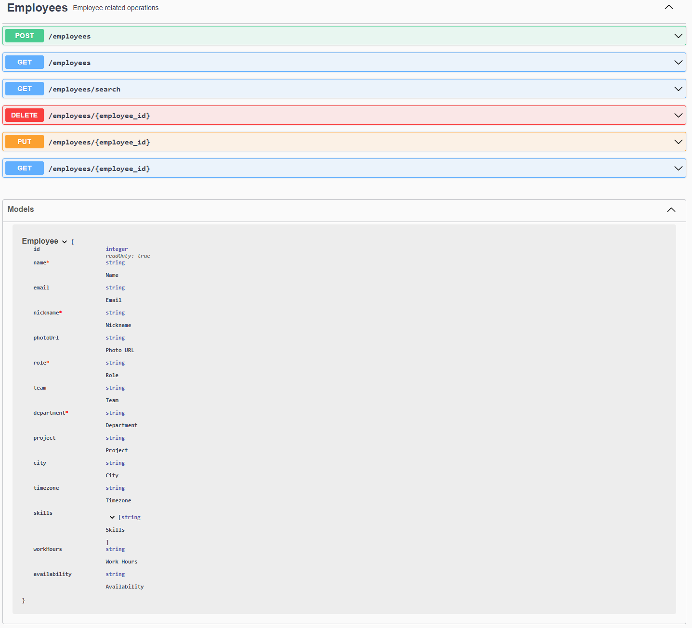
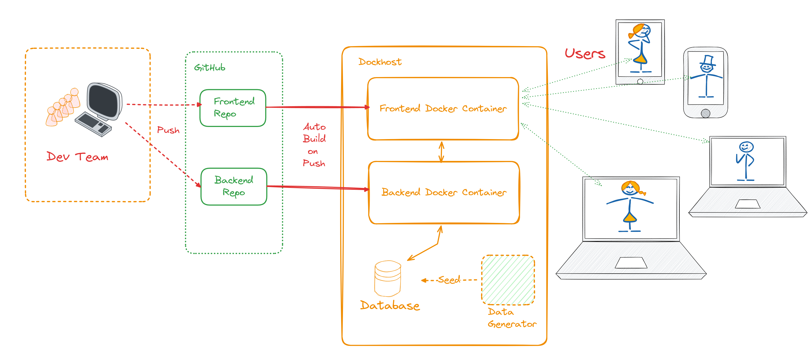
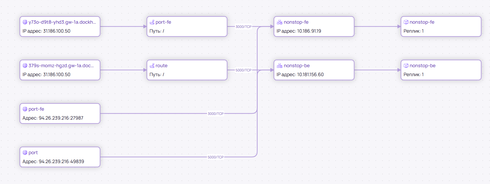

# NonStop Hack&Change 2024 Backend

Сервис для поиска сотрудников по различным фильтрам.

## Команда и роли

Анастасия Кузьменко - аналитик, капитан

Николай Тур - бэкенд

Анатолий Сургутов - фронтенд

Наталия Ананьева - дизайн

Андрей Федотов - девопс, фронтенд


## Публичный API

Swagger: https://379s-momz-hgzd.gw-1a.dockhost.net/



## Внутренний API

Заполнить БД сотрудниками:

```bash
GET /internal/employees?count={employees_count}
```

*employees_count* - количество сотрудников, которое нужно сгенерировать. По умолчанию - `100`.

## Локальный запуск

```bash
pip install -r requirements.txt
python app.py
```

## Инфраструктура

### Общая архитектура



## Карта сети в DockHub




